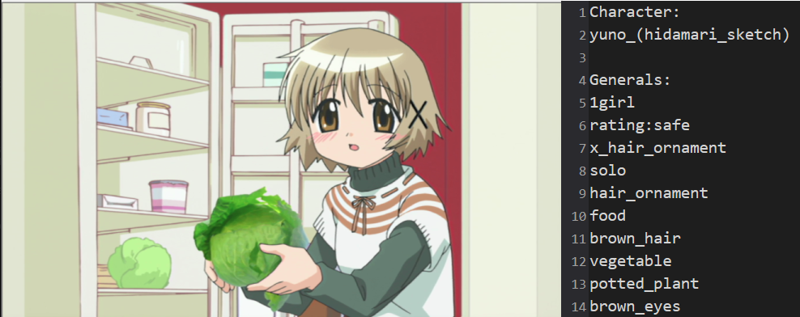

# NeoBooru
## Tagging massive amount of anime images automatically (and locally) using DeepDanbooru https://github.com/KichangKim/DeepDanbooru

<p align="center">
  
</p>

## Step 0: Create new **Conda** environment
```
conda create -n NeoBooru python==3.8
```

## Step 1: Install requirements
```
Click>=7.0
numpy>=1.16.2
scikit-image>=0.15.0
tensorflow>=2.7.0
tensorflow-io>=0.22.0
requests>=2.22.0
six>=1.13.0
```
```
pip install -r requirements.txt
```

## Step 1.5: Download pretrained models and unzip
https://github.com/KichangKim/DeepDanbooru/releases


## Step 2: Run main.py
```
optional arguments:
  -h, --help            show this help message and exit
  --gpu GPU_ID          GPU device id to use (Default=0)
  --cpu                 CPU only mode (Default=False)
  --model MODEL_PATH    Path to model file
  --tags TAGS_PATH      Path to tags file (txt)
  --chartag CHAR_PATH   Path to character tags file (txt)
  --target TARGET_PATH  Path to image/folder
  --threshold THRESHOLD
                        Threshold for tag confidence. (Default=0.5 [0.1 - 0.99])
  --limit TAG_LIMIT     Limit for amount of tags. (Default=5). Doesn't affect character 
```

Examples:
### CPU Only
```
python "NeoBooru\main.py" --cpu --model "NeoBooru\model\model-resnet_custom_v3.h5" --tags "NeoBooru\model\tags.txt" --chartag "NeoBooru\model\tags-character.txt" --target "NeoBooru\test.png" --threshold 0.8 --limit 10
```

### GPU Single Image
```
python "NeoBooru\main.py" --model "NeoBooru\model\model-resnet_custom_v3.h5" --tags "NeoBooru\model\tags.txt" --chartag "NeoBooru\model\tags-character.txt" --target "NeoBooru\test.png" --threshold 0.8 --limit 10
```

### GPU Folder

```
python "NeoBooru\main.py" --model "NeoBooru\model\model-resnet_custom_v3.h5" --tags "NeoBooru\model\tags.txt" --chartag "NeoBooru\model\tags-character.txt" --target "NeoBooru\test_folder" --threshold 0.8 --limit 10
```

## Automatic folder categorization/file renaming TBA